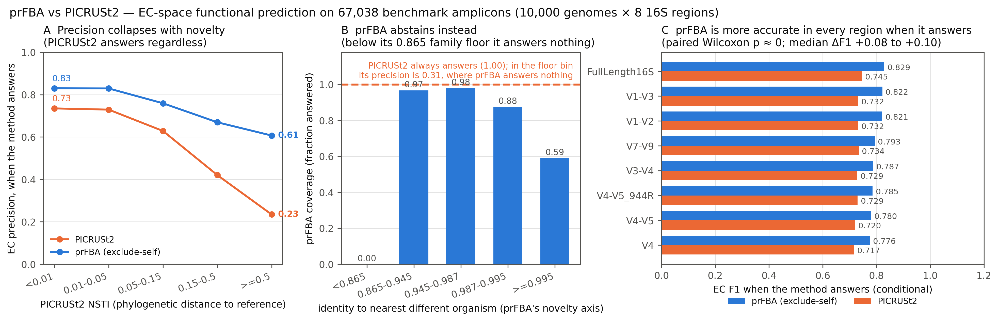

# prFBA vs PICRUSt2 — functional prediction on the 10k region-validation benchmark

Runs the 10,000-genome region-validation amplicon set through **PICRUSt2 2.6.3** and
compares its functional predictions with prFBA's, against the same truth (the source
genome's BV-BRC annotation) in the same namespaces (EC numbers, then ModelSEED
reactions). The two methods answer the same question from opposite directions: prFBA
aligns an amplicon to reference genomes and unions their gene content; PICRUSt2 places
the amplicon in a reference phylogeny and infers gene content by hidden-state
prediction.

**Headline.** When prFBA makes a call, it is the more accurate of the two everywhere
(EC F1 0.80 vs 0.73 overall; conditional per-region median F1 advantage +0.08 to +0.10,
Wilcoxon p ≈ 0 in all eight regions). PICRUSt2 effectively never abstains — 27 of 67,038
amplicons, dropped by `--min_align` — so across the *whole*
amplicon population its mean F1 is higher (0.73 vs 0.60) because prFBA abstains on 25%
of self-excluded amplicons. PICRUSt2's precision degrades sharply with phylogenetic
distance (0.74 → 0.24 across NSTI bins) while prFBA's degrades slowly (0.83 → 0.61) and
it declines to answer instead. Much of PICRUSt2's apparent deficit is **annotation-system
disagreement, not prediction error**: its own annotation of a genome already in its
reference recovers only 90.4% of that genome's BV-BRC truth ECs at 74.3% precision, so
it is operating at ~94% of its achievable recall and at its precision ceiling.

## Install (this machine, no conda / no root)

PICRUSt2 needs R and three compiled tools, so it does not fit in a single venv.
Per the session's constraint, the Python side is a uv venv and nothing else is
system-installed:

| component | where | how |
|---|---|---|
| PICRUSt2 2.6.3 + deps | `~/Documents/picrust2_venv` (uv, py3.12, `pandas<3`) | `uv pip install -e ~/opt/picrust2/src/picrust2-2.6.3` (editable: the 470 MB reference files live in the source tree and `setup.py` does not package them) |
| R 4.4.3 + `castor` 1.8.7 | `~/opt/picrust2/R`, `~/opt/picrust2/Rlib` | Posit's Ubuntu 24.04 `.deb` unpacked with `dpkg-deb -x`, hard-coded `/opt/R/4.4.3` paths rewritten, `castor` from Posit Package Manager binaries |
| epa-ng 0.3.8, gappa 0.9.0, HMMER 3.4, GLPK 5.0, zlib/bison/flex | `~/opt/picrust2/bin` | built from source (`src/build_tools.sh`); no project ships usable Linux binaries |

```bash
source ~/opt/picrust2/activate.sh     # venv + PATH + R_LIBS_USER
```

PICRUSt2's own test suite: **60 passed, 1 failed** — the failure is
`test_run_place_seqs_pipeline_sepp`, which needs the optional SEPP placement tool;
EPA-ng is the default and is installed.

## Pipeline

```bash
cd region_validation/picrust2_comparison
python scripts/prepare_inputs.py --outdir data/full_inputs --batches 8
bash   scripts/run_picrust2.sh data/full_inputs data/full_picrust2 2 30   # ~1 h 40 m
python scripts/prfba_selection.py --out data/prfba_selection.json
python scripts/prfba_selection.py --out data/prfba_selection_legacy.json --legacy
python scripts/fetch_bvbrc_annotations.py genomes
python scripts/fetch_bvbrc_annotations.py pgfams        # 4.17M families, ~16 min
python scripts/function_maps.py
python scripts/genome_function_sets.py
python scripts/annotation_ceiling.py
python scripts/compare.py
```

| script | role |
|---|---|
| `prepare_inputs.py` | study FASTA (60,461 md5-unique amplicons) + dummy abundance table, optionally split into batches or a stratified pilot |
| `run_picrust2.sh` | `picrust2_pipeline.py -p 30 --in_traits EC,KO --no_pathways` per batch, resumable |
| `prfba_selection.py` | re-runs the shipped `select_references.select_representatives` per amplicon, include-self and exclude-self (τ=0.987) via `score_genecap.exclude_self_record`; `--legacy` reproduces the manuscript's reducer |
| `fetch_bvbrc_annotations.py` | source-genome assembly accessions; `family_product` for every PGFam in play (explicit User-Agent — BV-BRC 403s Python's default; failed batches are never cached as empty) |
| `function_maps.py` | PGFam product → EC (parsed) and → ModelSEED reactions (ModelSEEDpy `split_role`/`convert_to_search_role` → template roles → complexes → reactions); EC → ModelSEED reactions from `Unique_ModelSEED_Reaction_ECs.txt` |
| `genome_function_sets.py` | projects all 49,109 relevant genomes into EC / reaction space |
| `annotation_ceiling.py` | BV-BRC truth vs PICRUSt2's *own* reference annotation of the same genome |
| `compare.py` | per-amplicon metrics, strata, paired Wilcoxon tests |

Batching is sound because PICRUSt2 treats every study sequence independently: EPA-ng
places per query, the bacteria/archaea choice is per sequence, and an unknown tip cannot
change another tip's parsimony states.

## Comparison design

* **Truth** — the source genome's PGFam set (the same truth `score_genecap.py` uses),
  projected to EC numbers via BV-BRC `family_product` strings.
* **prFBA prediction** — union of the PGFam sets of the reference genomes the shipped
  selector picks, i.e. the content of the synthetic genome, projected identically.
* **PICRUSt2 prediction** — `combined_EC_predicted.tsv.gz`, copy number > 0 (all values
  are integers under max-parsimony HSP).
* **Same projection everywhere.** Family-level products lose some ECs that feature-level
  products carry (0–112 per genome in spot checks), so truth *and* prFBA go through the
  identical map and the loss cancels; `annotation_ceiling.py` prices what remains.
* **Shared vocabulary.** EC metrics are restricted to the 2,132 ECs both annotation
  systems can express (PICRUSt2 columns ∩ BV-BRC family-product ECs); reactions to the
  7,043 reachable from those.
* **Empty truth excluded** — 953 of 67,991 amplicons whose source genome projects to no
  EC are dropped from all means (never scored as failures).
* **Both denominators** — *conditional* (amplicons with a prediction) and *population*
  (abstention = recall 0 / F1 0), as `DESIGN.md` §7 requires.
* **`rxn_role`** — prFBA's PGFam-product → ModelSEED-role → reaction route, reported
  separately (it tracks the EC route within 0.01) and never mixed into the head-to-head.
* **How many references prFBA unions** — median 1 per answered exclude-self amplicon
  (n = 50,341 scored cells), so its precision advantage comes from picking one good
  genome, not from averaging many.



*`figures/F1_prfba_vs_picrust2.png` (+ PDF), from `scripts/render_comparison.py`: (A)
PICRUSt2's EC precision against its own NSTI distance, (B) prFBA's coverage against its
novelty axis, (C) per-region conditional F1.*

## Results (EC space, all regions, n = 67,038)

| method | coverage | recall | precision | F1 | Jaccard | population recall | population F1 |
|---|---|---|---|---|---|---|---|
| prFBA include-self | 1.000 | 0.999 | 0.943 | 0.964 | 0.942 | 0.999 | 0.964 |
| prFBA exclude-self (τ=0.987) | 0.751 | 0.835 | 0.790 | **0.798** | 0.690 | 0.627 | 0.600 |
| PICRUSt2 | 1.000 | 0.849 | 0.669 | **0.729** | 0.595 | 0.848 | 0.729 |

ModelSEED reaction space tracks EC space within ~0.01 throughout (prFBA exclude F1
0.801, PICRUSt2 0.722). The legacy selector scores marginally higher than the shipped
union default when it answers (exclude F1 0.807 vs 0.798) at the same coverage.

prFBA's include-self row is near-tautological — include-self selection usually picks the
source genome itself, whose annotation *is* the truth — exactly as the region study's
95–99% include-self gene capture is. The informative rows are exclude-self and the
strata below.

### Stratified by whether the source genome is in PICRUSt2's reference

2,720 of 9,746 benchmark source genomes (19,686 amplicons) have their exact assembly in
PICRUSt2's reference (GTDB-based lineages; the shipped metadata does not state a
release); a further 1,493 share an NCBI taxid with a reference
genome. This is PICRUSt2's closest analogue to prFBA's self-inclusion, though an
imperfect one: GTDB is species-dereplicated, so "not in reference" often still has a
conspecific, and prFBA's exclusion additionally strips every ≥0.987-identity neighbour.

| stratum | method | coverage | recall | precision | F1 |
|---|---|---|---|---|---|
| in reference (n=19,686) | PICRUSt2 | 1.000 | 0.868 | 0.735 | 0.792 |
| | prFBA include | 1.000 | 1.000 | 0.967 | 0.981 |
| | prFBA exclude | 0.827 | 0.863 | 0.836 | 0.840 |
| not in reference (n=47,352) | PICRUSt2 | 1.000 | 0.841 | 0.641 | 0.703 |
| | prFBA include | 1.000 | 0.998 | 0.933 | 0.957 |
| | prFBA exclude | 0.719 | 0.821 | 0.768 | 0.779 |

### Precision under increasing novelty

PICRUSt2 answers every amplicon at any distance; the cost is precision.

| PICRUSt2 NSTI | n | PICRUSt2 recall | PICRUSt2 precision | prFBA-exclude recall | prFBA-exclude precision |
|---|---|---|---|---|---|
| < 0.01 | 19,770 | 0.871 | 0.735 | 0.860 | 0.830 |
| 0.01–0.05 | 23,076 | 0.857 | 0.729 | 0.869 | 0.829 |
| 0.05–0.15 | 16,588 | 0.829 | 0.628 | 0.820 | 0.759 |
| 0.15–0.5 | 6,877 | 0.812 | 0.420 | 0.730 | 0.669 |
| ≥ 0.5 | 701 | 0.768 | 0.235 | 0.661 | 0.607 |

By prFBA's own novelty axis (best non-self identity), the contrast is sharper still: for
the 567 amplicons whose nearest different organism is below the 0.865 family floor,
prFBA abstains on all of them (coverage 0.000) while PICRUSt2 still predicts, at
precision 0.313.

### Per-amplicon paired comparison (EC F1, Wilcoxon, Holm-adjusted)

| region | conditional: prFBA / PICRUSt2 | median Δ | prFBA wins / losses | population: prFBA / PICRUSt2 | median Δ |
|---|---|---|---|---|---|
| FullLength16S | 0.829 / 0.740 | +0.091 | 5,236 / 712 | 0.683 / 0.745 | +0.075 |
| V1-V2 | 0.821 / 0.729 | +0.096 | 5,135 / 875 | 0.662 / 0.731 | +0.075 |
| V1-V3 | 0.822 / 0.729 | +0.096 | 5,325 / 848 | 0.676 / 0.732 | +0.078 |
| V3-V4 | 0.787 / 0.710 | +0.080 | 4,891 / 1,169 | 0.578 / 0.728 | +0.041 |
| V4 | 0.776 / 0.695 | +0.082 | 5,280 / 1,382 | 0.547 / 0.716 | +0.032 |
| V4-V5 | 0.780 / 0.699 | +0.085 | 5,413 / 1,259 | 0.553 / 0.720 | +0.037 |
| V4-V5_944R | 0.785 / 0.707 | +0.082 | 5,206 / 1,207 | 0.559 / 0.729 | +0.037 |
| V7-V9 | 0.793 / 0.716 | +0.085 | 5,189 / 1,209 | 0.580 / 0.734 | +0.043 |

Every test is significant (p_holm ≤ 5e-14; conditional tests p ≈ 0). Note the sign
reversal between denominators: the *median* amplicon favours prFBA under both, but
prFBA's abstentions pull its *mean* below PICRUSt2's in the population view.

### Annotation-system ceiling (the number that frames everything above)

For the 2,689 scoreable genomes present in both systems, PICRUSt2's own reference
annotation vs BV-BRC truth for the *same genome* — no prediction involved:

| universe | recall | precision | Jaccard |
|---|---|---|---|
| shared vocabulary | 0.904 | 0.743 | 0.688 |
| full vocabulary | 0.891 | 0.676 | 0.623 |

So PICRUSt2's measured 0.868 recall / 0.735 precision on in-reference genomes is ~96% of
its ceiling recall and essentially *at* its ceiling precision: as a predictor it is
nearly perfect, and the residual gap to prFBA in this benchmark is dominated by the two
projects annotating genomes differently. An equivalent study scored against PICRUSt2's
annotation system rather than BV-BRC's would move the absolute numbers, not the
coverage-vs-precision trade-off, which is the real finding.

### Other observations

* **Domain routing.** PICRUSt2 sends 10.2% of archaeal amplicons (467 of 4,587) to the
  bacterial tree, since it picks whichever domain gives the lower NSTI; 99.9% of
  bacterial amplicons route correctly (`data/domain_routing.csv`).
* **Direct agreement.** prFBA include-self and PICRUSt2 agree on only Jaccard 0.57–0.61
  of ECs per amplicon (mean, by region) — consistent with the annotation ceiling rather
  than with either method being wrong.
* **PICRUSt2 exclusions.** 24 sequences (27 amplicons) aligned to under 80% of the
  reference (`--min_align`) and were dropped before placement; ~80 more exceed the
  default NSTI 2.0 cutoff that standard PICRUSt2 usage discards.
* **Vocabulary asymmetry.** 95.3% of the 4.17M PGFams in play are "hypothetical
  protein"; only 16,633 carry an EC. Genomes project to a median of 472 ECs.

## Caveats

1. PICRUSt2 cannot be made self-excluding per amplicon (its reference is fixed), so the
   in-reference / not-in-reference split is an approximation of prFBA's two regimes.
2. Database sizes differ by ~4×: prFBA selects from ~112k BV-BRC genomes with cached
   PGFams, PICRUSt2 from 27,870 reference genomes. Part of prFBA's precision advantage
   is database coverage, not algorithm.
3. Truth is BV-BRC/RAST annotation projected through family products; see the ceiling
   section. Both sides share the projection, but PICRUSt2's annotations were made by a
   different pipeline on GTDB assemblies.
4. Predictions are binarized (copy > 0 / present in any selected reference). prFBA's
   per-function probabilities and PICRUSt2's copy numbers are not compared here.
5. KO predictions were produced but not analysed: ModelSEED carries no local KO →
   reaction map, so EC is the only bridge both systems share.

## Files

Everything under `data/` is git-ignored except the distilled summaries
(`comparison_summary.json`, `annotation_ceiling.json`, `domain_routing.csv`). Bulk
artifacts: `full_picrust2/` (per-batch PICRUSt2 output), `comparison_cells.csv.gz`
(per-amplicon × method × space rows), `pgfam_products.json` (~400 MB),
`genome_function_sets.json`, `prfba_selection*.json`.
